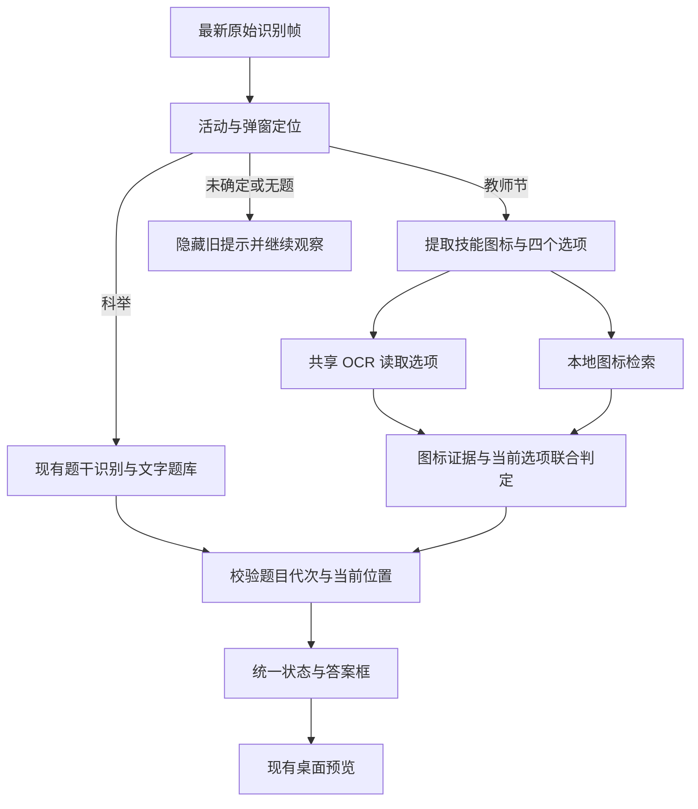

# XYQQuiz 0.4：教师节答题设计方案

日期：2026-09-01（北京时间）

状态：设计稿；本次仅编写方案和执行离线可行性探查，尚未实现 0.4 功能。

源码基线：`v0.3-webview` 工作区，`pyproject.toml` 版本 0.3.1，提交 `4b64e71`。该工作区已有前端及测试修改，后续开发须保留这些修改。

## 1. 用户已确定的范围

- 增加教师节“看图说话”：识别题图中的技能，在四个文字选项中找到对应名称，并在实时预览中框出答案。
- 自动识别科举和教师节界面，自动切换识别逻辑。
- 优先适配游戏画面 1024×768 及以上分辨率；较低分辨率保留兼容方向，降低本轮优先级。
- 延续本地离线题库、手动更新题库、候选答案框和连续换题清理机制。
- 沿用 0.3.1 的采集、桌面窗口、预览和 OCR 执行后端设置。

教师节图标补录、自动操作游戏、其他活动题型，以及重做主界面均不列入本方案的交付范围。已有科举本地补题继续保留，入口明确标为科举用途。

## 2. 已核实的事实与验证边界

### 2.1 官网题库

入口：[看图说话大全](https://w.163.com/h5/xyq/dtk/index.html#/jiaoshijie)。本次页面入口脚本为 `app.82e45b63.js`，教师节路由对应 `pageb.3e074f37.js` 的模块 7345。正式更新器必须动态解析路由和资源，不能固定这些文件名或模块编号。

当前教师节数据为 336 条、25 个分类、335 个不同名称。每条包含 `Id`、`TypeName`、`Type`、`Name`、`PicName`、`Pic`。本次下载并解码成功 336/336 张图标，合计 1,212,631 字节，约 1.16 MiB。

图标存在不同宽高和边框，部分不是正方形；图片后缀也不能作为实际格式的唯一依据。“破釜沉舟”在坐骑技能和大唐官府中各有一条，对应不同图标。记录不能按名称去重。

数据来源：[官网页面资源](https://w.163.com/h5/xyq/dtk/static/js/pageb.3e074f37.js)。336 条是本次官网快照数量，不作为永远不变的题库规模。

### 2.2 四张实际截图

| 样本 | 文件像素尺寸 | 对照答案 | 选项 |
| --- | --- | --- | --- |
| 1 | 1280×980 | 连环击 | D |
| 2 | 1284×970 | 健身术 | B |
| 3 | 1280×963 | 百毒不侵 | C |
| 4 | 1288×976 | 古董评估 | D |

这些是截图文件尺寸，不能据此认定游戏设置或 Windows 缩放比例。

对 0.3.1 的离线探查结果：

- 使用 `config.example.json` 的现有布局配置，四张截图的布局检测均返回空。现有定位器不能直接完成教师节定位。
- 人工圈定四个选项后，复用现有 CPU `RapidOCREngine` 和 `OCRRole.OPTION`，16/16 个选项文字均与截图一致。这验证了选项 OCR 的可复用性，未验证自动裁剪。
- 人工圈定题图后，对全库 336 张图标做简单多尺度 NCC 匹配，样本 1、2、4 的正确图标排名第一；样本 3 的“指地成钢”得分 0.72017，“百毒不侵”得分 0.71978，正确图标排名第二。
- 样本 3 的四个选项是血雨、后发制人、百毒不侵、阎罗令。“指地成钢”不在选项中，说明当前选项是有效的消歧证据。
- 上述朴素全库匹配单张约 258～332 ms，包含遍历和临时缩放，不能当作优化后的性能或端到端耗时。

证据摘要见 [离线探查记录](evidence/v0.4-teachers-day-probe.json)。当前没有自动定位到最终画框的完整验证，也没有教师节真实连续帧、多分辨率实机验证。

## 3. 总体设计

采用“共享运行底座 + 活动识别 + 两条识别分支”。科举继续使用文字题库；教师节增加图标题库和专用处理器。保持一个采集源、一个协调器和一个 OCR 工作线程。



这里的活动类型与现有 `RuntimePhase` 独立：教师节也会经历识别中、候选、已识别、无法确定等状态。连答计数用于诊断，不参与题目身份或答案判定。

## 4. 自动识别活动与定位弹窗

### 4.1 识别证据与优先级

新增 `ActivityLayoutDetector`，向协调器返回活动观察结果，区分“无题”“疑似答题但活动未确定”“活动和布局已确定”。

教师节主要使用“看图说话”标题、固定提示区域和 2×2 选项布局共同确认。标题模板用于快速定位；有歧义时，在局部标题或提示区域使用 OCR 复核。人物头像、背景颜色、四个方框或任意一个技能图标都不足以单独决定活动。

专用教师节证据的优先级高于通用面板几何结果。现有 `PanelGeometryLayoutDetector` 会给几何结果标记 `keju-panel-fallback`，这个标记不能作为活动识别证据。科举几何回退仍需现有科举锚点、已验证的标题特征或可信科举题干匹配确认。

两个活动证据冲突、标题遮挡而无法确认时，进入未确定状态并隐藏旧答案；教师节判定失败不能把同一固定提示强行送入科举题库输出答案。已有活动的短时检测缓存也必须检查活动特征是否仍然存在。

### 4.2 教师节定位方法

增加独立教师节布局描述，记录标题、弹窗范围、图标、固定提示、四个按钮及各按钮内部文字区域。按钮顺序固定为左上 A、右上 B、左下 C、右下 D。

通过标题与至少一个位置独立的锚点估计弹窗平移和缩放，使用选项网格复核几何关系。锚点在横纵两个方向都应有足够间距；不以每题变化的技能图标作为布局锚点。

所有业务区域相对于弹窗定义。定位后先估计图标区域，再在邻域细化边界，容忍一至数像素裁剪差异。选项文字区域与用于画框的完整按钮区域分别保存，避免文字裁剪边界决定框选大小。

首次搜索覆盖合理的游戏画面区域；后续优先在上次弹窗邻域重定位，失效后扩大搜索。游戏分辨率变化时，弹窗像素尺寸可能保持不变，因此搜索尺度依据弹窗本身，不能只乘全屏分辨率比例。

现有科举布局配置继续生效。教师节布局由活动注册处独立加载，旧 `layout_paths` 只含科举配置时也能启用教师节。

## 5. 图标与选项联合判定

### 5.1 图标预处理和检索

图库在加载时完成解码与预计算；识别期间使用内存快照。比较过程保留颜色和空间结构，生成完整图标、适度去边框的主体图以及梯度特征，降低相似底色或边框对结果的支配。

预处理按图标有效区域保持比例，必要时补边；针对像素边界差异允许小范围平移、缩放和裁剪。不能把所有源图标直接拉伸成某个固定正方形并认为已经对齐。

检索分为轻量粗排和局部精排：

1. 全库预计算特征粗排，初始保留前 12 个记录。
2. 四个 OCR 选项映射出的所有图标记录一并加入候选集合，同名不同图标全部保留。
3. 对候选集合进行多尺度颜色结构与梯度精排，得到每条记录的图像证据。
4. 计算每个选项对应记录中的最佳图像证据，以及不同选项之间的差距。

前 12 个是初始检索参数，需要在图库变体回放中检查召回率；候选集合始终包含已可靠读取的当前选项，避免粗排丢失正确项。图像分数不直接复用科举的文字匹配阈值。

### 5.2 选项 OCR 和名称匹配

复用当前 `OCRRole.OPTION` 的裁剪、分行与失败回退行为，优先做规范化后的名称精确匹配。规范化继续沿用现有 Unicode、标点等处理；模糊名称只作为 OCR 重试线索，不静默改写为“最接近的技能”。

完整读取四个选项是输出教师节答案框的条件。缺字、重复到无法区分、顺序不确定或名称不能可靠映射时，用最新帧重试相关选项。可以在侧栏显示已有识别结果，但不先猜一个位置。

### 5.3 接受、消歧与拒绝

输出必须同时具备可信活动布局、完整图标、可靠选项和足够图像证据。当前选项用于排除题目没有提供的技能；同名记录竞争不算两个不同答案。

样本 3 应在全库近似图标中，结合当前选项选择“百毒不侵”。若两个近似技能同时出现在选项中，必须满足不同选项间的区分条件，否则保持无法确定。

全库证据也用于发现选项之外的明显冲突：当图像明确支持一个不在选项中的技能时，先检查 OCR、裁剪与过渡帧，不能强制在四个候选里选第一名。所有选项的图像证据都弱时同样拒绝输出。

沿用现有三级表现：

| 结果级别 | 教师节条件 | 展示 |
| --- | --- | --- |
| HIGH | 图像与选项唯一对应，并达到校准后的高可信门槛 | 现有高可信实线框 |
| CANDIDATE | 通过基本有效性门槛，有唯一候选，但证据强度未达 HIGH | 现有候选虚线及分数样式 |
| NONE | 活动、布局、图标、选项不完整，或不同答案仍有歧义 | 清除答案框，显示原因 |

图像最低分、选项间差距和高可信门槛在实施第一阶段使用正负样本校准并固化为版本化配置。四张截图只用于种子验证；NCC 数值和综合分都不标成“正确概率”。发布前必须固定参数并对独立回归样本复验。

## 6. 连答、换题与过期结果

教师节的固定文字提示不构成题目身份。新增活动专用的连续性判断，将“同题是否仍在”和“能否复用答案”分开处理。

- 题目内容观察：活动类型、图标主体、按 A/B/C/D 排列的选项文字区域。
- 运行身份：目标窗口、原始帧尺寸、弹窗位置与尺度、当前题目代次。
- 知识身份：活动对应的题库 generation 和匹配参数版本。

题图改变、选项内容或顺序改变、活动切换、目标窗口切换、分辨率变化、题库替换时，先递增代次并清框，再安排新的识别。即使技能图标相同，选项重排也必须重新定位答案。

悬停高亮、按钮边框、连对数字和背景人物移动不应单独触发换题。稳定性观察聚焦图标主体和文字笔画，对轻微抗锯齿变化保持容忍；完整像素哈希仅作证据，不作为不断阻塞识别的唯一稳定条件。

首题等待至少两次不同 `frame_id` 的一致观察。教师节明确变化当次就隐藏旧框；短暂定位丢失也先隐藏框，内部可保留 150 ms 的重定位上下文。重新定位后需复核内容和坐标再显示。

异步任务携带活动、题目代次、布局身份和题库 generation；发布前同时核验。已经开始执行的 OCR 可以结束，但过期结果不得进入前端或当前答案缓存。

缓存可保留已验证的技能身份和答案名称，选项位置始终来自当前题面。图像感知哈希只用于寻找缓存候选，命中后仍验证内容；不单凭哈希复用答案框。教师节无法确定时按 0.2、0.4、0.8 秒退避重试，内容变化立即恢复快速识别。科举既有策略独立保留并做回归。

## 7. 数据模型与代码接入

### 7.1 新增或扩展的数据

- `ActivityKind`：`keju`、`teachers_day`、`unknown`；无答题界面时活动字段为空。
- `ActivityDetection`：活动证据、是否存在疑似答题界面、已确认布局与不能确认的原因，供协调器区分“消失”和“疑似切换”。
- `DetectedLayout`：扩展活动类型、弹窗矩形、可选图标矩形和选项文字区域；现有题干、按钮矩形继续保留。
- `TeacherSkillRecord`：来源编号、分类、技能名称、来源图片地址、本地图片路径和内容摘要。唯一键使用 `teachers_day:<Id>`；名称不是主键。
- `TeacherBankSnapshot`：不可变记录集合、名称到多条图标的索引、图像特征、题库 generation 和算法参数版本。
- `RecognitionResult` / `RuntimeSnapshot`：增加活动类型、图标匹配分、图标候选差距、匹配原因及题库 generation。教师节明确赋值综合分，避免落入原有文字分数计算路径。

教师节不把固定提示伪装成 `QuestionRecord.question`，也不把图像分写进 `question_score`。科举旧字段继续使用；教师节前端根据活动类型展示新的图像证据。

### 7.2 代码落点

| 位置 | 计划变更 |
| --- | --- |
| `recognition/activity.py`、`recognition/teachers_day_layout.py`（新增） | 活动观察、教师节定位、专用区域提取 |
| `recognition/teachers_day.py`（新增） | 图标与选项联合判定、教师节结果构造 |
| `knowledge/teacher_bank.py`、`knowledge/teacher_matcher.py`（新增） | 图库加载、索引、候选检索与图像证据 |
| `knowledge/teacher_updater.py`（新增） | 教师节来源提取、资源下载、整代校验和发布 |
| `recognition/pipeline.py`、`recognition/ocr.py` | 保留科举分支；抽取共享 OCR 调度器供两种活动使用 |
| `runtime/coordinator.py`、`runtime/state.py` | 活动路由、代次校验、教师节连续性与缓存、状态扩展 |
| `launcher.py`、`config.py`、`runtime/paths.py` | 注册两种活动、加载旧配置、补齐缺失教师节默认资源 |
| `web/app.py`、`web/static/*` | 活动状态、不同评分含义、按题库反馈更新结果 |
| `diagnostics.py` | 保存活动证据、原始/归一化图标、选项裁剪和匹配详情 |
| `packaging/*`、构建清单、自检和公开树审计 | 包含教师节数据，检查两套题库和所有本地图标 |

现有 `RecognitionPipeline` 内部持有一个 OCR 线程池，`RapidOCREngine` 按线程保存模型实例。实施时把线程池所有权集中到共享调度器，两个处理器都复用同一个线程；预热与关闭只执行一次，不能通过新建第二个处理器暗中常驻第二份 OCR 模型。

## 8. 题库保存、更新与升级

### 8.1 分活动保存

保留科举原有路径，新建独立教师节子目录，减少旧数据迁移：

```text
data/
  current.json                         # 现有科举指针
  generations/.../keju_questions.json  # 现有科举数据
  teachers_day/
    current.json
    generations/<generation>/
      records.json
      metadata.json
      icons/<content-hash>.<format>
  layouts/
    teachers-day.json
    anchors/teachers-day-*.png
```

教师节元数据记录来源、抓取时间、记录数、图片数、记录和资源清单摘要。每张图标校验实际解码结果与摘要；本地文件名由程序生成，保证记录引用的是该代目录内资源。

### 8.2 更新流程

1. 从入口解析教师节路由和动态资源，在该路由对应模块中按字段结构提取数据；不依赖压缩后的变量名，也不执行网页脚本。
2. 校验编号唯一、名称/分类/图片地址有效；仅去除完全重复的相同记录，同名不同记录保留。
3. 在临时 generation 下载图片，允许有限并发、超时和重试；对每张图片实际解码并验证本地引用完整。
4. 当前基线的首次导入要求至少 300 条；已有题库的更新若记录骤减超过 20%，视为异常而保留旧代，等待核查来源。这是导入保护值，可随确认过的官网变化调整。
5. 全部校验通过后预建索引，原子替换该活动的 `current.json`，安装不可变快照并使相关识别缓存失效。
6. 任一资源缺失、解码失败或记录检查失败，整代教师节更新失败，继续使用旧代。更新期间正在识别的任务持有旧快照；旧文件在任务释放后才允许清理。

“更新题库”一次更新两种活动，分别原子提交并分别报告结果。科举成功、教师节失败时明确展示部分成功及教师节继续使用的旧版本；接口返回分活动结果，不能让统一成功提示掩盖其中一个失败。

界面状态区显示两套题库的数量、更新时间与可用状态。正常启动和答题不触发下载。

### 8.3 从 0.3 升级

现有便携初始化仅在整个 `data` 不存在时复制默认数据；用户带着旧 `data` 升级时会缺少教师节子目录，必须单独处理。

增加“仅补齐缺失教师节目录”的原子初始化，从包内默认数据建立完整教师节代；保留原科举指针、本地补题和设置。新增配置使用默认值，旧 `config.json` 无教师节字段也能加载。教师节数据使用独立的 `schema_version`，本次无需为科举数据强制改版。

已有教师节数据损坏时尝试上一有效代或包内校验通过的默认代，并显示当前实际来源。若教师节资源均不可用，仅该活动显示不可用，科举和预览仍正常启动。更新、热切换、启动恢复分别验证，不能只验证下载文件存在。

## 9. 主界面与诊断

主界面延续原有布局，只增加必要信息：

- 活动状态：“科举”“教师节·看图说话”或“正在判断题型”。自动切换，无需用户选择模式。
- 科举显示原有题干和文字匹配信息；教师节显示已识别技能、选项、图标匹配信息及当前判定原因。
- 继续采用现有候选框和高可信框样式，综合分仍是相对评分。
- 更新题库后按活动显示成功、失败及保留版本。

现有“本地补题”管理保留为科举功能。教师节状态不能自动填入科举补题表单或写入其覆盖记录。

教师节诊断增加活动判定证据、布局/图标矩形、原始与标准化图标、四个选项及 OCR 结果、全库/选项内候选、分项得分、拒绝原因、活动题库代次、清框和结果发布时间。复用已有用户主动导出流程；本轮四张完整截图继续作为本地私有样本，不进入公开仓库或发布包。

## 10. 分辨率与性能

识别使用当前捕获后端提供的原始识别帧。布局粗搜可在缩小画面上执行，但图标和选项裁剪回到原始帧；答案框也在原始帧坐标计算，再通过现有归一化坐标映射到预览。不能拿 1024 像素宽的预览流当作原始识别输入。

首轮优先验证 1024×768、1280×960、1920×1080，并扩展到 1280×1024、1600×900、2560×1440。分辨率、Windows 缩放、游戏自身界面缩放分别记录。更高分辨率沿用弹窗定位规则，按实际覆盖结果声明支持程度。

离线测试覆盖整体等比缩放、弹窗仅平移、画布扩大而弹窗像素不变等情况。合成缩放用于检验算法不变量，不替代真实游戏分辨率验证。

继续保持预览与识别独立节拍：默认 30 FPS 预览，活动题面最高 15 Hz 观察，无题 5 Hz。OCR 和完整图标匹配仅在新题或必要重试时执行。

本机 CPU 预热后的设计目标为：完整稳定题面出现到答案框可见 P95 ≤500 ms；确认内容或活动变化到发送清框事件 ≤100 ms。冷启动单独记录。指标需要在实现后的完整链路中测量，当前探查并未达到或验证这些指标。

## 11. 验收与发布条件

| 验证项 | 要求 |
| --- | --- |
| 四张真实截图 | 从完整截图自动定位、OCR、图标匹配到结果，依次得到 D/B/C/D；不依赖手工矩形 |
| 相似图标 | “百毒不侵/指地成钢”联合选项正确消歧；二者同时出现且证据不足时不出确定答案 |
| 图库检索 | 336 张图标的缩放、边框偏移和压缩变体检查召回；独立样本验证接受门槛，记录误接受情况 |
| 无效题面 | 空白/截断/遮挡图标、OCR 缺项、答案不在选项、非答题游戏场景不产生有效答案框 |
| 连续换题 | 图标变化、同图选项重排、相同题再次出现、悬停高亮、计数变化和过渡帧均符合第 6 节规则 |
| 异步任务 | 切换活动、窗口、分辨率或题库后，延迟返回的旧任务无法恢复旧框 |
| 自动切换 | 科举→教师节→科举、答题窗口关闭及重新打开，类型、内容和框位置正确 |
| 分辨率 | 核心验证 1024×768、1280×960、1920×1080 的真实画面；扩展分辨率逐项记录实际/合成覆盖 |
| 题库更新 | 两库全部成功、部分成功、下载失败、损坏图片、中断、热更新和离线重启均保留可用状态 |
| 升级与打包 | 携带旧配置/旧 data/本地补题启动成功；缺少教师节子目录时自动补齐；解压后离线可用 |
| 科举回归 | 原有题型、候选框、本地补题、OCR 后端及预览基本行为无回归 |
| 性能 | 按第 10 节分别记录完整链路和分阶段指标，确认仍只有一个 OCR 工作线程/模型实例 |

真实样本使用本地忽略目录及私有 fixture manifest；公开测试使用抽象数据和不含用户画面的素材。真实连续帧和核心分辨率实机结果是发布证据，未完成的项目在发布说明中明确记录，不用静态四图通过代替。

## 12. 实施顺序

1. **建立图标库与联合匹配器。** 固化本次来源快照和四个种子案例，完成图标检索、选项联合判定、相似图标/未知图标校准；输出可复验的算法报告。
2. **完成教师节专用定位。** 从完整截图自动取得题图与四个选项；优先跑通四图和核心分辨率，记录真实与合成验证边界。
3. **接入自动切换和实时协调器。** 统一共享 OCR，加入活动身份、题目代次、换题清框和过期任务拒绝；完成连续帧回归。
4. **接入界面、题库更新和旧版本初始化。** 完成两库状态、分活动更新反馈、科举补题隔离和诊断信息。
5. **完成运行与便携包验收。** 做科举回归、实际活动连续验证、性能测量和旧目录迁移演练，再构建 0.4 发布候选包。

本轮设计已明确产品行为和实现方向。识别阈值、实际分辨率覆盖和性能数据属于上述实施阶段需要产出的验证结果；本设计不将其记为已完成。
